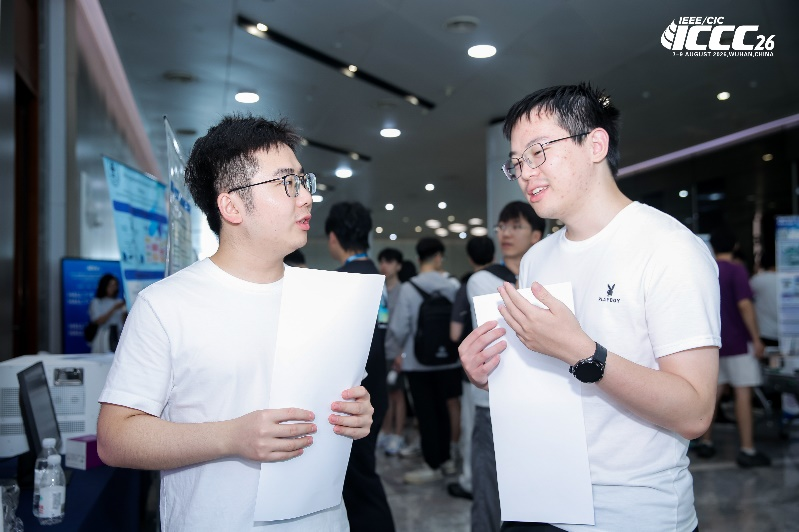
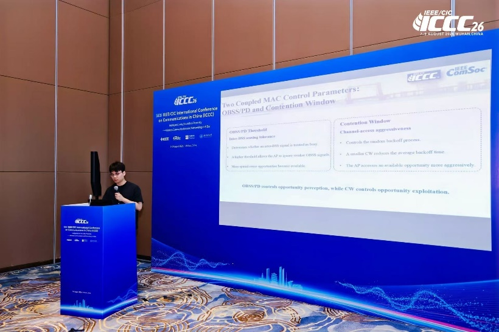
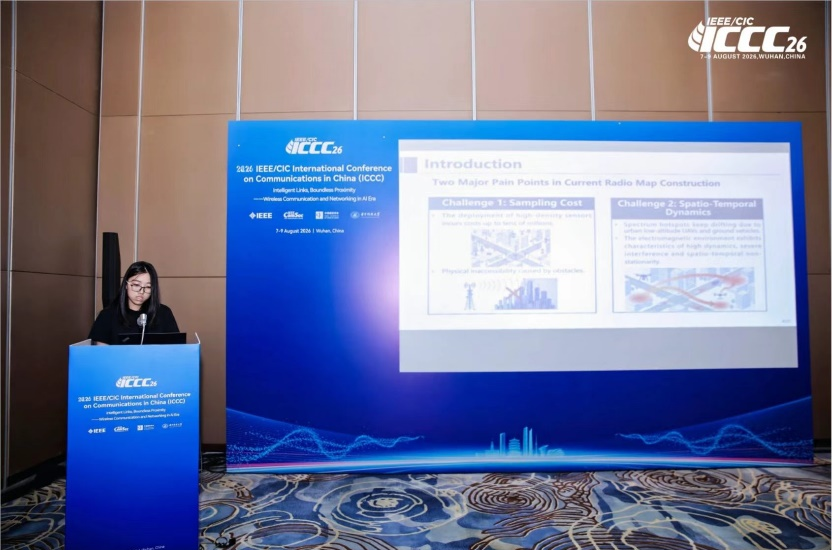

喜讯 | 团队多项研究成果与系统Demo亮相 IEEE ICCC 2026

<!--more-->

2026年8月7日至9日，ICCC 2026大会（2026 IEEE/CIC International Conference on Communications in China，ICCC）在武汉光谷科技会展中心顺利召开。ICCC汇聚了全球信息通信领域的顶尖专家、学者与产业界代表，深度聚焦6G演进、智能无线网络、数字孪生及空天地一体化等前沿方向，全面展示最新科研突破与产业落地进展。

团队在此次大会中展现了扎实的科研实力，多项学术报告、系统演示成果精彩亮相：

1）Tutorial报告（王秀程）：针对导频受限的MIMO‑OFDM系统，提出了基于路径级无线电地图辅助的快速稳健信道估计架构，将环境几何先验转化为结构化信息，有效解决了极端低开销场景下的信道精确重构难题。

2）系统Demo展示（贾宏刚）：现场展示了名为“3D‑EM Twin”的高保真低空三维无线电数字孪生系统，实现了从稀疏测量到密集三维电磁场态势感知的亚秒级重构与弹性航迹规划支持。

3）学术论文（尉家豪）：针对密集Wi‑Fi网络共信道干扰与竞争开销问题，提出了一种基于多智能体强化学习的可靠性感知MAC联合自适应优化机制，大幅提升了密集网络吞吐量并显著降低尾部时延。

4）学术论文（尚佳瑶）：针对动态无线电地图在极稀疏采样下的热点漂移问题，提出了一种融合信息效率最大化采样、稀疏贝叶斯学习与时空演进预测的时空协同重构框架，在超低采样率下实现了对移动发射源的高精度感知与跟踪。

此次多项成果的入选与展示，体现了团队在智能无线通信、无线电地图与低空网络等方向的持续深耕与创新活力。