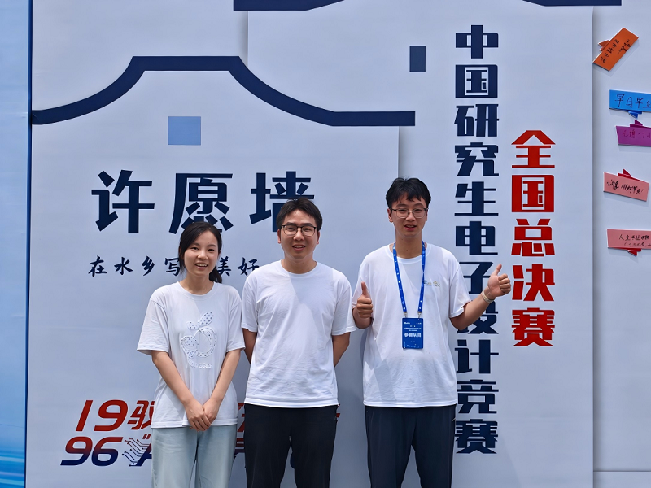

新闻 | 我室承楠教授指导团队斩获第二十一届中国研究生电子设计竞赛全国一等奖

<!--more-->
2026 年 8 月11日—14日，第二十一届中国研究生电子设计竞赛全国总决赛于浙江桐乡隆重举办。作为国内研究生电子信息领域规模最大、影响力最强的学科竞赛，本届大赛以“驭电逐光、AI 无界”为主题，汇聚全国多所高校科创精英同台比拼，展开创新思维与工程实践能力的巅峰对决。本届赛事自2026年4月开赛，共有全国379所高校及科研院所参与，征集参赛作品9967件，参赛师生超4万人，赛事规模再创新高。西安电子科技大学参赛团队奋勇争先，共斩获全国一等奖18项，刷新学校参赛历史最好成绩，学校荣膺大赛最高团体荣誉“最佳团体奖”，再次获评优秀组织单位。

本次实验室贾宏刚、张逸帆、陈文文三位同学组建队伍，在承楠教授指导下参与开放赛道下的**华为6G先进无线技术探索专项赛**。该专项赛面向下一代移动通信发展愿景，聚焦6G关键技术突破，重点围绕6G网络架构、原生AI、数字孪生、通感一体等前沿方向征集创新方案，鼓励研究生面向产业技术痛点开展创新性系统、平台与算法研究。

团队参赛作品为 **AgentRay：智能体驱动的无线环境数字孪生平台**。项目紧扣6G智能通信与原生AI发展趋势，融合智能体、电磁数字孪生技术，构建面向复杂无线场景的环境感知、电磁推演与网络智能决策平台，为6G无线网络的仿真验证、规划优化提供全新解决方案。经过赛区材料评审、现场答辩等层层筛选，项目获得西北赛区一等奖，并晋级全国总决赛，在全国39支华为6G专项赛入围队伍中突围，斩获全国一等奖。

首次参赛便获得如此佳绩，充分体现实验室科研方向对前沿技术的精准把握。实验室深耕电磁空间孪生、智能体赋能无线网络等前沿领域，紧跟6G技术演进浪潮，在理论研究与工程原型实现方面均积累扎实成果。实验室引导研究生打破理论研究与工程实现之间的壁垒，鼓励同学们把科研前沿思考转化为可落地的创新作品，持续培育兼具创新视野与动手能力的新一代通信科研人才。

### 赛事简介
中国研究生电子设计竞赛是国内研究生电子信息领域顶尖学科竞赛，覆盖面广、参赛规模大，致力于推动高校研究生创新实践能力培养，搭建产学研创新交流平台，聚焦电子信息领域前沿技术，促进学生科研成果工程化落地。

### 团队相关成果
团队长期深耕无线电磁数字孪生、大模型智能体、6G原生AI方向，前期产出iRadioDiff、AgentMap等系列理论框架，本次AgentRay实现理论算法向工程原型系统落地，打通从算法建模到平台原型的完整链路，推进6G电磁数字孪生技术实用化探索。

### 开源与论文链接
竞赛官方报道：https://www.gedc.net.cn/
团队主页：https://unic.xidian.edu.cn/